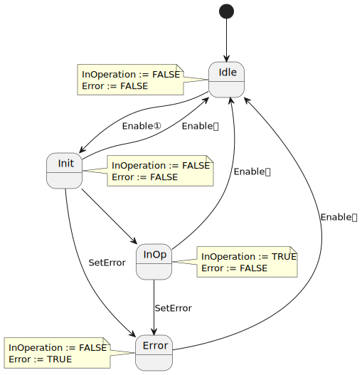
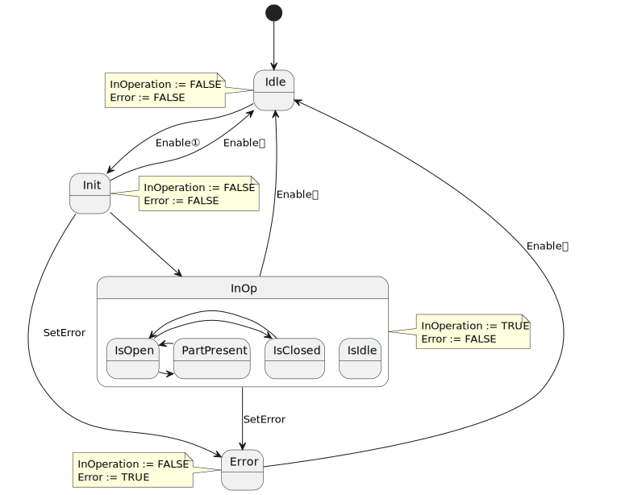
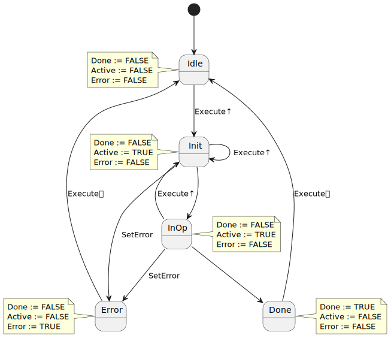

<h1 align="left">
  <br>
  
  <br>
  HEI-Vs Engineering School - Industrial Automation Base
  <br>
</h1>

Cours AutB

Author: [Cédric Lenoir](mailto:cedric.lenoir@hevs.ch)

# LAB 04 A function block for an actuator

Dans ce travail, nous allons construire un gripper, ou pince.

# Sensor
Dans le cadre de ce travail pratique, nous utilisons un capteur à effet hall d'origine Schunk.

<figure>
    
    <figcaption>Schunk MMS 22-IO-Link</figcaption>
</figure>

> Ce capteur utilise la technologie **IO-Link**. Il est utilisé pour déterminer la position d'ouverture d'un actioneur pneumatique.

> Ce qui nous intéresse au niveau de la programmation PLC, c'est le format de donnée qu'il fournit.

# Gripper

<figure>
    
    <figcaption>Schunk MGM-plus 40</figcaption>
</figure>

> Noter les deux vis en dessus du logo Schunk qui servent à maintenir le capteur.

## Données techniques
Pince pour petites pièces MPG-plus, Taille: 40, pneumatique

|Intitulé                           |Valeurs|
|-----------------------------------|-------------|
|Course par doigt| 6 mm|
|Force à la fermeture| 135 N|
|Force à l'ouverture| 110 N|
|Température ambiant maxi.          | 90 °C|

> Ces données techniques concernent principalement la personne qui va gérer le hardware.

Avec un système de programmation empirique on pourrait se dire que tout ce dont nous avons besoin pour un capteur, c'est une entrée analogique ou digitale, donc en fin de compte, un ``REAL`` ou un ``BOOL``.

Dans la pratique, une simple entrée ou sortie sera entourée d'une logique qui permettra de la mettre en forme et de la valider. Afin d'éviter de réécrire la même logique pour chaque entrée et chaque sortie, nous allons encapsuler l'ensemble dans un bloc. Le Bloc fonctionnel.

# Objectif
Comprendre le fonctionnement d'une machine d'état complexe.
Comprendre et écrire un bloc fonctionnel de type Execue.
Comprendre et écrire un bloc fonctionnel de type Enable.

# HMI
Utilisez le HMI de base pour visualier quelques valeurs.

# Type Enable
Nous allons utiliser le type Enable pour savoir si le gripper est ouvert ou fermé.

## State Machine
<figure>
    
    <figcaption>Enable In Operation Base</figcaption>
</figure>

## Your Job
Use the folder Your Job in the project of the BaseInterfaceUA to create your ENUM, FB.

### FB name: 
**FB_GripperState**
Utiliser le type **UA_Schunk_mms** comme I/O hardware.

> Pensez à créer le FB en Structured Text.

Utiliser quatre seuils, *threshold* en **entrée** avec un type correspondant à celui du Hardware:
-	thOpen
-	thClosed
-	thPartMin
-	thPartMax

pour déterminer en fonction de la position du capteur, un des trois signaux de **sortie** suivants:

-	IsOpen
-	IsClosed
-	Partpresent

Dans ce cas, on va intégrer une machine d'état intermédiaire dans l'état **InOp** du FB Enable. Attention, il est possible que l'état soit indéterminé, par exemple si la pression d'air est manquante, dans ce cas, le signal d'erreur doit être activé.

-	Utilisez **E_InOperationBase** pour l'Enum de base.
-	Utilisez **E_InOpGripper** pour l'Enum spécifique à ce FB.
-	Initialisez vore machine d'état interne dans Idle.
-	Vérifiez l'état du gripper dans Init et déterminer l'état de base de la machine interne de InOp avant de passer dans cet état.
-	Ne pas oublier les deux sorties de base du FB de type Enable.
-	Les sorties **IsOpen**, **IsClosed** et **PartPresent** ne peuvent être actives que quand la mchine d'état principale est en **InOp**.

> Notez qu'il n'y a pas de transition pour l'état **IsIdle**, puisque la machine d'état interne est iniialisée dans Init.
> L'état **IsIdle** dans InOp conduit à une **erreur**.

<figure>
    
    <figcaption>Enable In Operation Base with sub-states</figcaption>
</figure>

## Avant de traiter la machine d'état ``E_InOperationBase``
Nous avons à considérer qu'**il ne faut pas générer une erreur **pendant que le gripper est en mouvement. Ne pas confondre un état transitoir avec le cas où l'alimentation en air est absente.

Comme condition d'entrée, nous utilisons un timer pour générer un signal ``tonIdleCondition.Q ``basé sur les seuils, th*** et le signal du capteur.

Dès l'instant ou les zones transitoires sont traitées à l'aide du timer, il ne sera plus nécessaire de traiter ces zones dans la suite du code.

## Vous testez ce FB.
Vous pouvez utiliser les variables suivantes pour lier les sorties de votre FB avec le HMI:
```iecst
stTestFbGripperHmi.gripperStateClosed := ...
stTestFbGripperHmi.gripperStateOpen := ...
stTestFbGripperHmi.gripperStatePartPresent := ...
stTestFbGripperHmi.gripperStateError := ...
stTestFbGripperHmi.gripperStateInOp := ...
```

## Intégrer le FB avec le code suivant: 

```iecst
(**************************************************************************
    YOUR CODE HERE
**************************************************************************)
fbGripperState.Enable := (stPlcOpenFbs.bEnableRemote)        		OR
                   		 (NOT stPlcOpenFbs.bEnableRemote 		AND 
				   		  NOT (fbPackStates.state.Aborting OR
                               fbPackStates.state.Aborted)); 
fbGripperState(hw := GVL_Abox.uaAboxInterface.uaSchunk);

```

Cela signifie que si, par exemple on ouvre la porte, l'état de la machine sera en **Aborted** et cela désactivera le FB, par exemple pour supprimer l'erreur. Il suffira ensuite de faire un **Reset** pour passer dans l'état **Stopped** et le FB sera de nouveau activé.


# Type Execute
Nous allons créer deux FB de type Execute pour piloter le Gripper.
**FB_OpenGripper** et **FB_CloseGripper**.

## Rappel
<figure>
    
    <figcaption>Execute Done Base</figcaption>
</figure>

## Your job !

Pour chacun des FB, utiliser en I/O:
-	```hwSensor := UA_Schunk_mms;```
-	```hwEV := UA_Festo;```

Utiliser un paramètre d'entrée
``thClosedMin``, pour la valeur **min** à atteindre par le sensor pour que le Gripper soit considéré comme fermé dans **FB_CloseGripper**.
``thOpenMax``, pour la valeur **max** à atteindre par le sensor pour que le Gripper soit considéré comme ouvert dans **FB_OpenGripper**.

Les autres entrées et sorties sont celles de base pour un FB de type Execute.

Enfin, on ajouter un timer de 1[s] pour contrôler le temps de fermeture ou d'ouverture du gripper. En cas de dépassement du délai, on affichera une erreur.

> Par rapport au model de base présenté dans le cours, on ne tiens pas compte de l'execute sur flanc montant sur Init et InOp. Par contre, **on garde le trigger sur le flanc montant pour passer de Idle à Init**.

> Ne pas oublier d'activer, ou pas, l'électrovanne.

> Ne surtout pas utiliser de la logique combinatoire pour piloter l'électrovanne!

C'est à dire:
```iecst
	hwEV.SetOut := (eExecuteDone = E_ExecuteDone.InOp); // Do not do like that !!!

	// Do like that:
	IF eExecuteDone = E_ExecuteDone.InOp THEN
		hwEV.SetOut := TRUE;		// Or FALSE
	END_IF
```
La raison est la suivente: si l'on utilise de la logique combinatoire, un autre FB ne pourra plus modifier hwEV.SetOut tant que le FB est actif. Le but d'un type Execute est d'activer ou piloter une action une fois.

> Par contre, ce que l'on peut aussi constater, c'est que ce FB, comme d'autres FB, restera dans un état interne indéterminé si il n'est pas appelé en continu, il pourrait pas exemple rester dans l'état E_ExecuteDone.InOp, ce qui empêcherait toute nouvelle commande Execute. C'est pour cette raison qu'il est important d'écrire une fois un FB correctement structuré.

## Tester le FB
On peut par exemple lier le FB au HMI en utilisant les variables suivantes: ``stTestFbGripperHmi.executeOpenDone`` et ``stTestFbGripperHmi.executeCloseDone``.

```iecst
fbOpenGripper(hwEV := GVL_Abox.uaAboxInterface.uaSchunkGripper,
	          hwSensor := GVL_Abox.uaAboxInterface.uaSchunk,
			  Done => stTestFbGripperHmi.executeOpenDone);

fbCloseGripper(hwEV := GVL_Abox.uaAboxInterface.uaSchunkGripper,
	          hwSensor := GVL_Abox.uaAboxInterface.uaSchunk,
			  Done => stTestFbGripperHmi.executeCloseDone);
```

## Une fois que tout fonctionne
On peut dans un premier temps activer le gripper en fonction de la machine d'état qui pilote l'axe X.

```iecst
fbOpenGripper.Execute := (stStateMachineInfo.eState = E_Execute.eMotionBackDone) OR 
                         (eStarting = E_Starting.eMotionStartingDone);

fbCloseGripper.Execute := (stStateMachineInfo.eState = E_Execute.eMotionFwdDone);
```

Finalement, on peut encore ajouter le code suivant pour empêcher les axes de bouger tant que gripper n'a pas terminé un mouvement.

```iecst
GripperIsOpen   := fbOpenGripper.Done;
GripperIsClosed	:= fbCloseGripper.Done
```

# Quelques liens
[IO-Link, site officiel](https://io-link.com)

[IODDfinder](https://ioddfinder.io-link.com)

